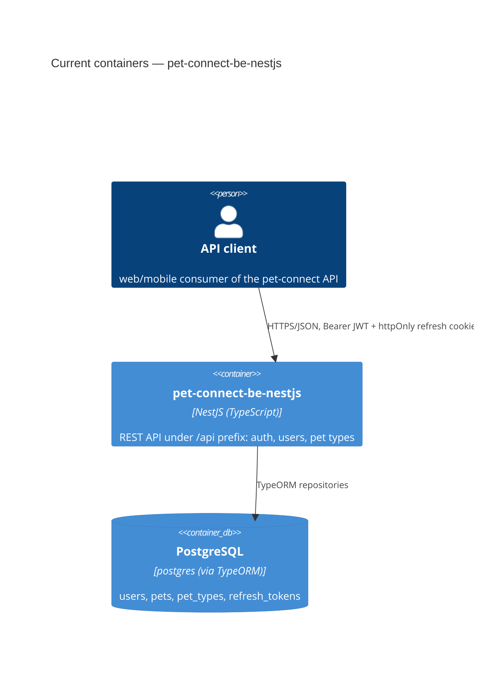

# Architecture map — pet-connect-be-nestjs

> The **current** architecture (what exists today), produced by `survey` and read by
> specify / design / data-model / implement. Refresh with `survey` when the repo drifts past
> `reflects_commit`. This is generated; a hand-maintained `docs/architecture.md`, if present, is
> authoritative and reconciled below — not replaced.

## Stack

- Language / runtime: TypeScript 5.1.3 on Node.js, NestJS 10.0.0 (`package.json:24-46`)
- Frameworks: `@nestjs/core`/`@nestjs/common` 10, `@nestjs/typeorm` 11 + `typeorm` 0.3.28, `@nestjs/jwt` 11, `@nestjs/config` 4, `class-validator`/`class-transformer`, `bcrypt` 6
- Build / test / lint: `npm run build` (`nest build`), `npm run test` (jest, rootDir `src`, `*.spec.ts`), `npm run test:e2e` (`test/jest-e2e.json`), `npm run lint` (`eslint --fix`) — `package.json:9-18`

## C4 — system as it is

## Module inventory

| Module | Path | Layers | Wired at | Responsibility |
|---|---|---|---|---|
| core/config | `src/core/config/configuration.module.ts` | infra | `src/app.module.ts` | Global `ConfigModule.forRoot({isGlobal:true})` — `.env` access everywhere |
| core/database | `src/core/database/database.module.ts:14` | infra | `src/app.module.ts` | `TypeOrmModule.forRootAsync`, postgres, `synchronize:true`, registers entities |
| core/auth | `src/core/auth/` (decorators, guards, interceptors, jwt, security, types) | infra/cross-cutting | `src/modules/auth/auth.module.ts` | AuthGuard (global via `APP_GUARD`), `@Public`/`@AuthUser`/`@SetCookie` decorators, CookieInterceptor, PasswordHasherService |
| modules/user | `src/modules/user/` | controller/service/entity/dto/mapper | `src/app.module.ts` | User CRUD, list-filtering, change-password; exports `UserService` |
| modules/auth | `src/modules/auth/` | controller/service | `src/app.module.ts` | register / sign-in / refresh / sign-out; owns global `AuthGuard` provider |
| modules/refresh-token | `src/modules/refresh-token/` | service/entity | imported by `auth.module.ts` | Opaque refresh-token issuance (crypto.randomBytes + sha256 hash) and rotation |
| modules/pet-type | `src/modules/pet-type/` | controller/service/entity/dto | `src/app.module.ts` | Simple CRUD (code/label) — the template for small lookup-table modules |
| modules/pet | `src/modules/pet/pet.entity.ts` | entity only | not yet wired (no controller/service/module registered) | Pet entity (name, dateOfBirth, ManyToOne PetType, ManyToMany User) — TODO.md lists full CRUD as unimplemented |
| common | `src/common/` | cross-cutting | imported ad hoc | `BaseEntity` (auto-increment id + timestamps), `DatabaseExceptionFilter` (`APP_FILTER`), generic `ListFilterModule` |
| shared | `src/shared/` | cross-cutting | imported ad hoc | Shared types/utils |

## Conventions (cited — the rules a new feature must match)

- **Module wiring / registration:** `@Module({ imports: [TypeOrmModule.forFeature([Entity])], controllers, providers, exports })` per feature module — `src/modules/pet-type/pet-type.module.ts:1-8`
- **Error handling:** global `DatabaseExceptionFilter` (`APP_FILTER`) maps Postgres `QueryFailedError` codes (23505→409, 23503→400) and passes through `HttpException`; services throw `NotFoundException`/`ConflictException`/`UnauthorizedException` directly — `src/common/filters/database-exception.filter.ts:12-54`
- **IDs:** auto-increment integer via `@PrimaryGeneratedColumn()` on `BaseEntity`, not UUID — `src/common/entities/base.entity.ts:8`
- **Persistence / DB access:** `@InjectRepository(Entity)` + TypeORM `Repository<T>` API directly in services, no custom repository classes — `src/modules/user/user.service.ts` (e.g. `userRepository.findOne(...)`)
- **Migrations:** none — `synchronize: true` auto-syncs schema on boot; no `migrations/` tree exists — `src/core/database/database.module.ts:14`
- **Tests:** Jest, `*.spec.ts` colocated under `src/` (rootDir `src`); currently **no unit spec files exist**, only an e2e stub at `test/app.e2e-spec.ts` — `package.json:64-80`
- **Inter-module communication:** direct synchronous service injection only, no event bus — e.g. `RefreshTokenService` injects `UserService` — `src/modules/refresh-token/refresh-token.service.ts`
- **Auth:** global `AuthGuard` (`APP_GUARD`) checks `@Public()` metadata, else verifies Bearer JWT and sets `request.user`; `@AuthUser('sub')` extracts claims — `src/core/auth/guards/auth.guard.ts:14-51`
- **Validation:** global `ValidationPipe({transform:true, whitelist:true, forbidNonWhitelisted:true})` + `class-validator` decorators on DTOs — `src/modules/user/dto/register-user.dto.ts:1-15`
- **UI / styling:** N/A — no frontend

## Datastores

| Store | Engine | Accessed via | Notes |
|---|---|---|---|
| Primary DB | PostgreSQL (`pg` driver) | TypeORM `Repository<T>` per entity, async config via `ConfigService` | `synchronize:true` (dev-style auto schema sync, no migrations); connection params from `.env` — `src/core/database/database.module.ts:14`. `mysql2` is installed but unused (no mysql config found). |

## Frontend / UI foundation

<!-- N/A: no frontend -->

## Where things live / closest precedents

- A new **simple lookup-table CRUD module** (e.g. Gender, per `TODO.md`) → `src/modules/<name>/`, modelled on `pet-type` (`src/modules/pet-type/pet-type.module.ts`, `pet-type.service.ts`).
- A new **richer CRUD module with relations + list filtering** (e.g. finishing Pet CRUD) → `src/modules/pet/`, modelled on `user` (`src/modules/user/user.service.ts`, `src/common/list-filter/`).
- A new **token-based flow** (e.g. Pet Invite, per `TODO.md`) → modelled on `refresh-token`'s pattern of `crypto.randomBytes` + hash + TTL (`src/modules/refresh-token/refresh-token.service.ts`).
- Cross-cutting infra (guards, interceptors, config, DB wiring) → `src/core/`, not `src/modules/`.
- Shared non-domain utilities → `src/common/` (entities/filters/list-filter) or `src/shared/` (types/utils) — the split between these two isn't sharply defined; follow whichever existing sibling is closest to the new utility.

## Constraints & known tech-debt

- **No migrations** — `synchronize: true` is unsafe for production; any schema-changing feature should introduce TypeORM migrations rather than relying on auto-sync, and `data-model` should treat this as a gap to close, not a convention to extend.
- **No unit tests exist** in `src/` — only an unstarted e2e stub (`test/app.e2e-spec.ts`). New features should not assume an established test pattern to copy; `plan-tests`/`implement` will be establishing the first real ones.
- **Pet module is incomplete** — entity exists but no controller/service/module wiring; `TODO.md` lists Pet, Pet Invite, Pet Type (list/get routes), and Gender as largely unbuilt.
- **Unused `mysql2` dependency** — installed but the only configured datastore is Postgres; don't assume dual-DB support.
- **RefreshToken.userId has no FK constraint** to User (per explorer scan) — a known looseness in the relation, worth tightening if touched.

## Reconciliation with the authored architecture doc

No authored architecture doc exists — `CLAUDE.md` is present but empty, and no `docs/architecture.md`/`ARCHITECTURE.md` was found. This map is the current reference.
