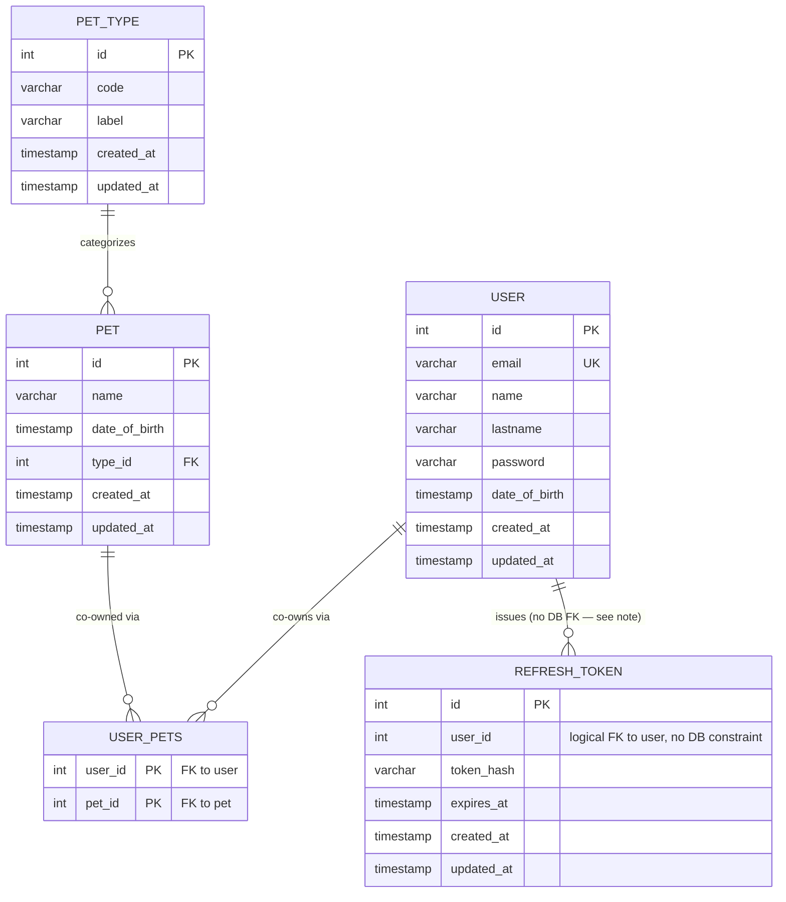

# Data model — pet

> **Scope note.** The `Pet` entity's shape is already final in code (`src/modules/pet/pet.entity.ts`) — this
> feature adds no new column. What *is* missing repo-wide is any migration tooling at all: the schema is
> produced only by TypeORM `synchronize: true` (`src/core/database/database.module.ts:14`), flagged in
> `sad.md` §11 as accepted debt this stage owns ("data-model should treat this as a gap to close, not a
> convention to extend"). Per user confirmation, this run **bootstraps the full current schema** —
> `user`, `pet_type`, `pet`, `user_pets`, `refresh_token` — as the first real migrations, using **TypeORM
> migrations** (native to the stack already in use) as the tool. See the audit report for the mandatory
> `synchronize: false` follow-up.

## ER diagram

## Entities

### `user`

Pre-existing table (not modified by this feature) — bootstrapped here because `pet`/`user_pets` FK-reference it.

| Column | Type | Constraints | Notes |
|---|---|---|---|
| `id` | SERIAL | PK | `@PrimaryGeneratedColumn()` via `BaseEntity` |
| `email` | VARCHAR | NOT NULL, UNIQUE | `@Column({ unique: true })` |
| `name` | VARCHAR | NOT NULL | |
| `lastname` | VARCHAR | NULL | `@Column({ nullable: true })` |
| `password` | VARCHAR | NOT NULL | hashed at the application layer (`PasswordHasherService`); never returned in any pet/co-owner response (spec §6.1, §7) |
| `date_of_birth` | TIMESTAMP | NULL | |
| `created_at` | TIMESTAMP | NOT NULL DEFAULT now() | `BaseEntity` |
| `updated_at` | TIMESTAMP | NOT NULL DEFAULT now() | `BaseEntity` |

**Aggregate root:** root.
**Access patterns:** co-owner identity lookups join through `user_pets` (see below) — never selects `password`.
**Constraints:** UNIQUE on `email`.

### `pet_type`

Pre-existing table (not modified by this feature) — bootstrapped because `pet.type_id` FK-references it.

| Column | Type | Constraints | Notes |
|---|---|---|---|
| `id` | SERIAL | PK | |
| `code` | VARCHAR | NOT NULL | |
| `label` | VARCHAR | NOT NULL | |
| `created_at` | TIMESTAMP | NOT NULL DEFAULT now() | |
| `updated_at` | TIMESTAMP | NOT NULL DEFAULT now() | |

**Aggregate root:** root (owned by the separate pet-type context, per spec §3/§9 non-goals).
**Access patterns:** existence check by `id` on every pet create/update (AC-03) — served by the PK, no extra index.
**Constraints:** none beyond PK (repo does not declare `code` unique; `sad.md` §11 flags the pet-type `CASCADE` FK as a separate open risk, not addressed here).

### `pet`

| Column | Type | Constraints | Notes |
|---|---|---|---|
| `id` | SERIAL | PK | |
| `name` | VARCHAR | NOT NULL | trimmed non-empty, within max length — enforced at the DTO layer (AC-01/AC-02), not a DB `CHECK` (repo doesn't use them) |
| `date_of_birth` | TIMESTAMP | NOT NULL | ≤ today (server UTC) — enforced at the DTO layer (AC-01/AC-02) |
| `type_id` | INTEGER | NOT NULL, FK → `pet_type(id)` ON DELETE CASCADE | indexed below; `ON DELETE CASCADE` matches the existing `@ManyToOne(() => PetType, { onDelete: 'CASCADE' })` — the silent pet-loss risk this implies is `sad.md` §11's open risk, routed to the pet-type context, not fixed here |
| `created_at` | TIMESTAMP | NOT NULL DEFAULT now() | |
| `updated_at` | TIMESTAMP | NOT NULL DEFAULT now() | |

**Aggregate root:** root.
**Access patterns:**
- Create/update validates `type_id` exists (AC-03, Flow 1/3/6) → served by `pet_type` PK.
- List pets, paginated, stable default order by `id` (AC-05, Flow 5) → served by PK, no extra index (offset pagination over PK order).
- Load-by-id on every view/update/delete/membership op, not-found before authz (AC-12, Flows 4/6/7/9/10) → served by PK.

**Constraints:** FK → `pet_type(id)` ON DELETE CASCADE.

### `user_pets` (join table — the pet's Membership)

Junction table for `pet.users <-> user.pets` (`@JoinTable({ name: 'user_pets', ... })` on `User.pets`). No `BaseEntity` audit columns — matches the repo's existing `@JoinTable` config (no `created_at`/`updated_at` declared on the join).

| Column | Type | Constraints | Notes |
|---|---|---|---|
| `user_id` | INTEGER | PK (composite), FK → `user(id)` ON DELETE CASCADE | |
| `pet_id` | INTEGER | PK (composite), FK → `pet(id)` ON DELETE CASCADE | indexed separately below — the composite PK's leading column is `user_id`, so a lookup by `pet_id` alone needs its own index |

**Aggregate root:** `pet` (Membership is managed inline as part of the pet aggregate, per spec §1/§4).
**Access patterns:**
- `assertCoOwner` — is caller in pet X's membership? (every write path, ADR-0001) → needs `pet_id` index (below).
- View a pet's co-owners (AC-08, Flow 8) → same `pet_id` index.
- Add/remove co-owner (AC-09/AC-10/AC-11) → same `pet_id` index; the composite PK enforces idempotent add (AC-09c) and prevents duplicate membership rows.

**Constraints:** composite PK `(user_id, pet_id)`; FK → `user(id)` ON DELETE CASCADE; FK → `pet(id)` ON DELETE CASCADE. The pet delete flow (AC-07b, Flow 7) relies on this `ON DELETE CASCADE` to clear membership links.

### `refresh_token`

Pre-existing table (not modified by this feature) — bootstrapped for schema completeness since it shares `user`.

| Column | Type | Constraints | Notes |
|---|---|---|---|
| `id` | SERIAL | PK | |
| `user_id` | INTEGER | NOT NULL | **no DB-level FK constraint** — `architecture-map.md` "Constraints & known tech-debt" flags this as an existing looseness; kept as-is (not this feature's scope to fix) |
| `token_hash` | VARCHAR | NOT NULL | sha256 hex of the opaque token (`RefreshTokenService.hashToken`) |
| `expires_at` | TIMESTAMP | NOT NULL | |
| `created_at` | TIMESTAMP | NOT NULL DEFAULT now() | |
| `updated_at` | TIMESTAMP | NOT NULL DEFAULT now() | |

**Aggregate root:** root.
**Access patterns:**
- `refresh()` looks up by `token_hash` (`RefreshTokenService.refresh`, exact match) → needs `token_hash` index.
- `deleteTokenByUserId(userId)` on sign-out/rotation → needs `user_id` index.

**Constraints:** none beyond PK (no FK, matching current entity — see note above).

## Indexes

| Index | Columns | Query it serves |
|---|---|---|
| `IDX_pet_type_id` | `pet(type_id)` | pet-type existence/validation join on every create/update (AC-03); FK-column index (universal safety rule) |
| `IDX_user_pets_pet_id` | `user_pets(pet_id)` | `assertCoOwner` membership check on every write path (ADR-0001); view co-owners (AC-08); add/remove co-owner (AC-09/10/11) |
| `IDX_user_pets_user_id` | `user_pets(user_id)` | already the composite PK's leading column — no separate index needed; listed only as the FK-column note |
| `IDX_refresh_token_token_hash` | `refresh_token(token_hash)` (unique) | `RefreshTokenService.refresh` exact-match lookup on every token refresh |
| `IDX_refresh_token_user_id` | `refresh_token(user_id)` | `RefreshTokenService.deleteTokenByUserId` on sign-out/rotation |

`user(email)` already carries a UNIQUE constraint (acts as its own index) — not listed again.

## Test fixtures

<!-- Jest, no fixture-factory convention exists yet in the repo (architecture-map.md: "no unit tests exist").
Per convention: match the repo when a pattern exists, confirm when it doesn't — plan-tests/implement will
establish the first real fixtures. Documented here as a placeholder so tasks/plan-tests knows what's needed. -->

- `newPetType(overrides?)` — builds a `PetType` fixture (code/label) for pet-creation tests.
- `newPet(overrides?)` — builds a `Pet` fixture referencing a fixture `PetType`.
- `newUser(overrides?)` — builds a `User` fixture with `email: 'user-<uuid>@example.test'`, no real-looking PII.
- `newCoOwnership(pet, ...users)` — attaches users to a pet's `user_pets` membership for authorization-path tests (AC-06/07/09, AC-10/10b/11).
