# Software Architecture Document — pet

## 1. Introduction and goals

**Intent.** Finish the half-built `pet` module of the pet-connect API so an Authenticated user can register a pet and co-manage it with the people who care for it. Every Pet lifecycle operation (create, view, list, update, delete) becomes available, with a new per-pet **membership** authorization boundary enforced on all writes and co-ownership managed inline — never leaving a pet ownerless.

**Top-3 quality goals (1-liners; full scenarios in §10):**

1. **Authorization correctness** — every write path re-verifies the caller is a Co-owner of the target pet (read-all, write-members).
2. **Data integrity under concurrency** — the no-orphan invariant holds even when Co-owners remove each other simultaneously.
3. **Privacy** — no pet or co-owner response ever exposes a user's password or credentials.

**Stakeholders.**

| Role | Interest | Sign-off owner? |
|---|---|---|
| Authenticated user | Registers pets, views/lists any pet | No |
| Co-owner | Edits/deletes a pet and manages its membership | No |
| Tech Lead | SAD approval, authz + concurrency model | Yes |
| Security Lead | Membership boundary + credential-exposure review | Yes |

<!-- Decision overrides (¶4) — none. -->

## 2. Constraints

**Technical.**
- TypeScript 5.1.3 on Node.js
- NestJS 10.0.0 (`@nestjs/core`/`@nestjs/common`), `@nestjs/typeorm` 11 + TypeORM 0.3.28, `@nestjs/jwt` 11, `class-validator`/`class-transformer`
- PostgreSQL (via TypeORM `Repository<T>`; `synchronize: true`, no migrations tree today)
- Layered feature-module architecture (controller / service / entity / dto / mapper), one NestJS module per feature

**Organisational.**
- Effort: S-feature on the `quick` route — a few days of work finishing an existing scaffold.
- Deadline: none fixed; unblocks the downstream pet-invite / assign-pet features.
- Team: single backend engineer; Tech Lead + Security Lead review.

**Conventions.**
- `docs/architecture-map.md` is the current-architecture reference; the `user` module (`src/modules/user/`) is the pattern for a relation-bearing CRUD module.
- Auto-increment integer IDs via `BaseEntity` (`@PrimaryGeneratedColumn()`), not UUID.
- Errors: services throw `NotFoundException`/`ForbiddenException`/`ConflictException`; the global `DatabaseExceptionFilter` maps Postgres error codes and passes through `HttpException`.
- Validation: global `ValidationPipe({transform, whitelist, forbidNonWhitelisted})` + `class-validator` DTOs.
- Inter-module comms: direct synchronous service injection, no event bus.

**Regulatory / external.**
- Data classification: internal — pet records and co-owner identities are user data, not regulated PII. No external compliance controls apply.
- Security review **required** (per spec §6.1): this feature introduces a new per-pet authorization boundary and exposes co-owner identity.

## 3. Context and scope

The pet module lets an Authenticated user register a pet (name, date of birth, an existing pet type) and share responsibility for it with other users as Co-owners. Reads are open to every Authenticated user (read-all); writes are restricted to a pet's Co-owners (write-members). The system depends on the existing pet-type context for the mandatory type reference and on the user context to resolve users being added as Co-owners.

<!-- brownfield: NestJS 10 + TypeORM/Postgres API; Pet entity exists (name, dateOfBirth, ManyToOne PetType CASCADE, ManyToMany User) but is unwired — no controller/service/module. Global AuthGuard authenticates all requests. -->

**External systems (in / out):**

| Actor or system | Type | Interaction |
|---|---|---|
| Authenticated user | Person | Registers, views, lists, updates, deletes pets; manages co-owners |
| Pet-type context | System (internal, separate bounded context) | Provides the mandatory pet-type reference; a pet may not reference a type that does not exist |
| User context | System (internal, separate bounded context) | Resolves the target user when a Co-owner is added |
| PostgreSQL | System (internal datastore) | Persists pets and the pet↔user membership |

**Trust boundary.** The global `AuthGuard` is the trust line: past it a request is *authenticated* but not *authorized* to write. There is no framework backstop for the write-members rule, so every write path re-checks membership itself (see §4, ADR-0001).

**C4 Context (L1):**

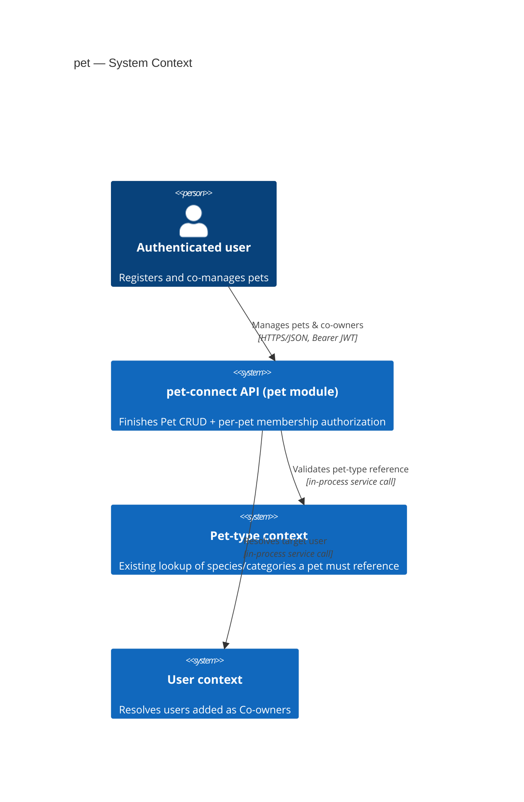

*Context:* one actor (the Authenticated user) reaches the pet module over authenticated HTTPS/JSON; the module depends on two internal contexts (pet-type, user) via in-process service calls and persists to a single Postgres datastore. No third-party/external system is involved.

## 4. Solution strategy

**Top strategic choices (the seeds for ADRs):**

1. **Finish the module as a relation-bearing CRUD on the `user` pattern** — controller / service / entity / dto / mapper, wired with `TypeOrmModule.forFeature([Pet])`, reusing the existing `ListFilterService` for the paged list. This keeps the feature inside established conventions and adds no new architectural style. (Target surface: **backend-service** only — no UI; derived from spec §1 «REST API for the Authenticated user».)
2. **Enforce write-members with an inline service-layer membership check** — each write method loads the pet once, returns not-found when it is absent (AC-12), otherwise verifies the caller is in the membership set before mutating. Chosen over a declarative guard because AC-12 demands not-found (not a 403) for a missing pet, and the service already needs the loaded pet. → **ADR-0001**.
3. **Protect the no-orphan invariant with a pessimistic-lock transaction** — remove-co-owner runs in a transaction that takes a write lock on the pet and its membership, counts remaining owners, and rejects a removal that would reach zero. Chosen over serializable-isolation-plus-retry for a single-row invariant. → **ADR-0002**.

Each tactical decision below traces to one of these seeds. Tactical decisions that contradict a strategic choice are surfaced in §11.

## 5. Building block view

Layered feature module (controller → service → TypeORM repository), matching the `user` module. The controller handles HTTP + DTO validation; the service holds all domain rules (membership authorization, the no-orphan invariant, pet-type validation) and owns the transaction boundary; a mapper projects entities to a credential-free public shape.

**Internal decomposition:**

```
src/modules/pet/
├── pet.entity.ts        (exists: name, dateOfBirth, ManyToOne PetType, ManyToMany User)
├── pet.module.ts        (new: TypeOrmModule.forFeature([Pet]) + ListFilterModule; imports PetTypeModule, UserModule)
├── pet.controller.ts    (new: routes, DTO validation, @AuthUser('sub') caller id)
├── pet.service.ts       (new: CRUD, assertCoOwner, membership tx, pet-type validation)
├── dto/                 (new: create-pet, update-pet [full replace], list/query, add/remove co-owner)
├── mappers/             (new: to-public-pet — never emits credentials)
└── types/               (new: pet filter + public-pet types, mirroring user/types)
```

**C4 Container (L2):**

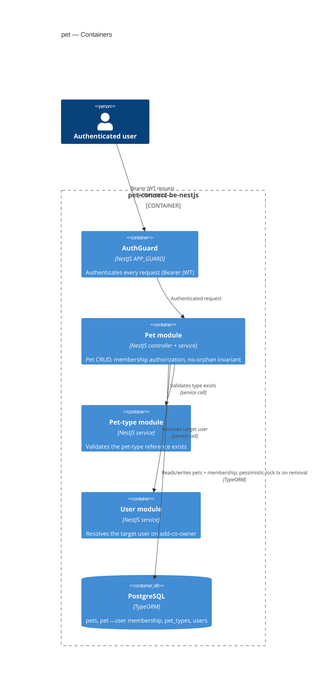

*Containers:* the single declared surface (backend-service) is the NestJS API. Every request passes the global AuthGuard, then reaches the Pet module, which calls the Pet-type and User modules in-process and reads/writes the shared Postgres datastore — taking a pessimistic write lock for membership removal.

## 6. Runtime view

**Critical flow 1: Register a pet (happy path — US-01 / AC-01)**

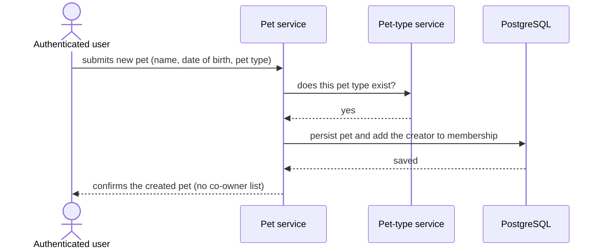

**Critical flow 3: Register a pet — validation & cross-context errors (US-01 / AC-02 / AC-03)**

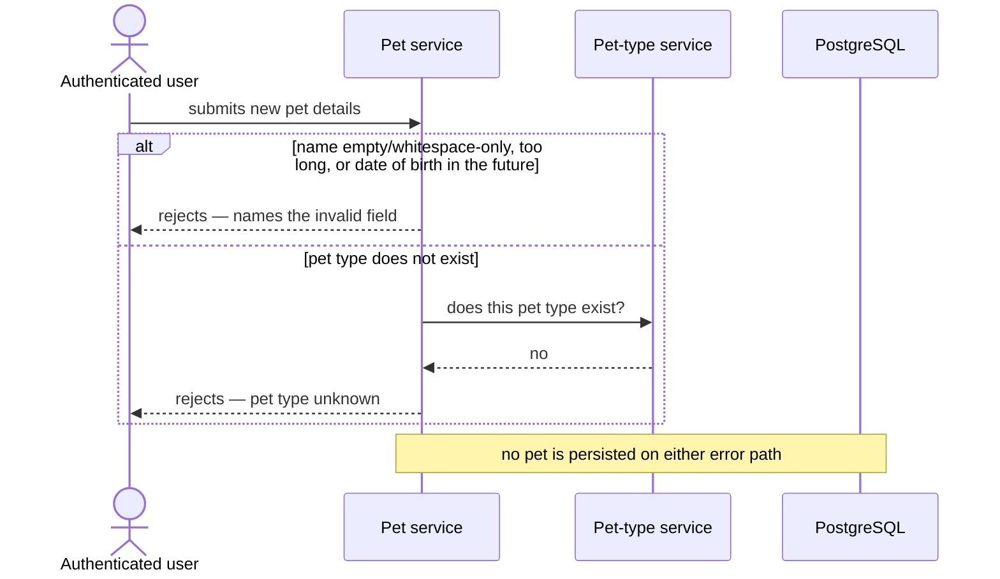

**Critical flow 4: View a pet (US-02 / AC-04 / AC-12)**

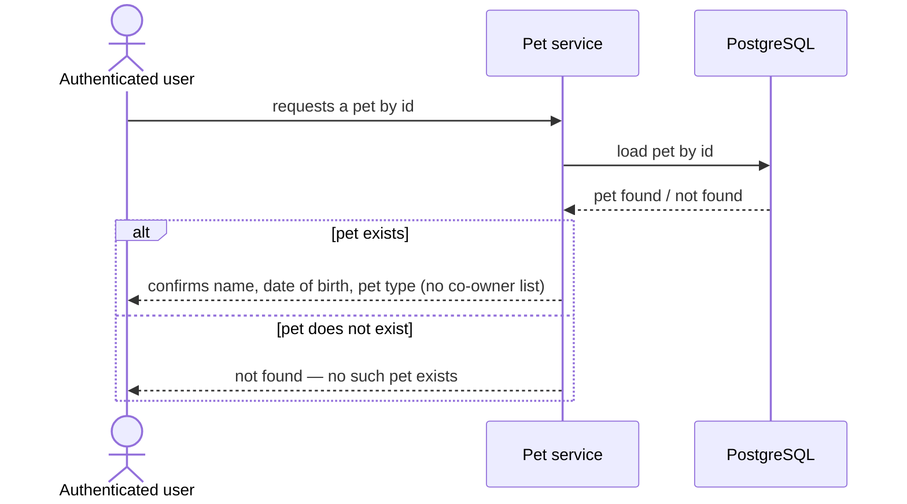

**Critical flow 5: Browse pets (US-03 / AC-05)**

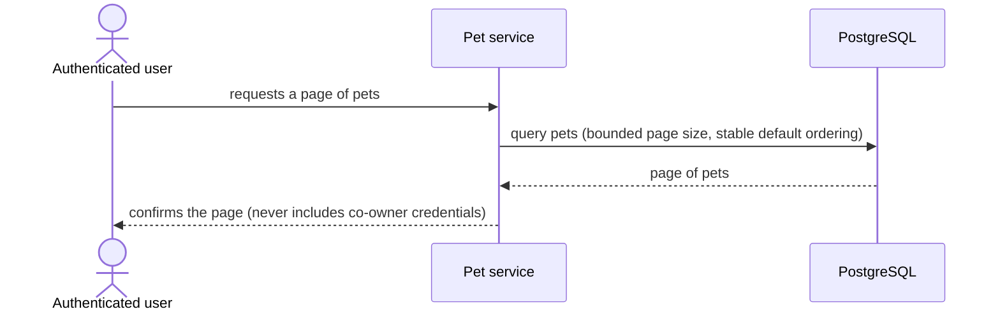

**Critical flow 6: Update a pet (US-04 / AC-06 / AC-06b / AC-03 / AC-12)**

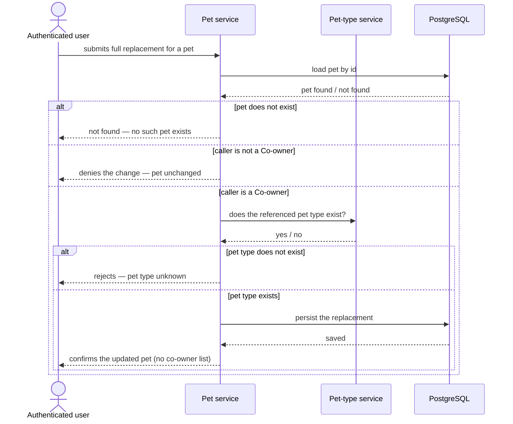

**Critical flow 7: Delete a pet (US-05 / AC-07 / AC-07b / AC-12)**

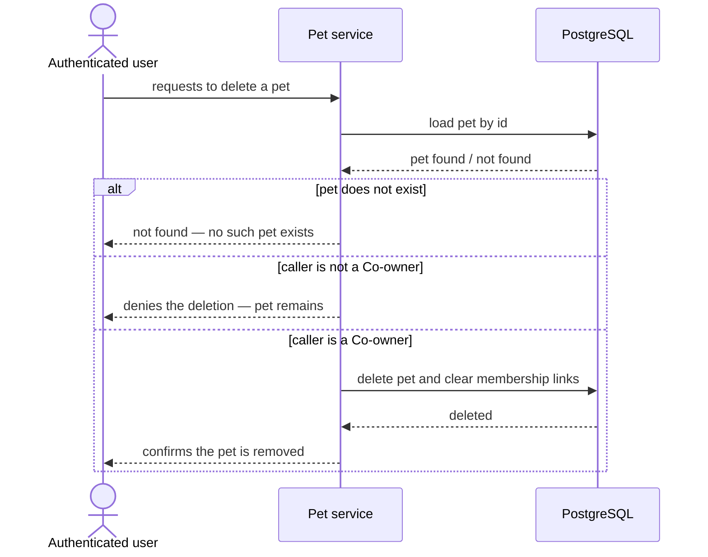

**Critical flow 8: View a pet's co-owners (US-06 / AC-08)**

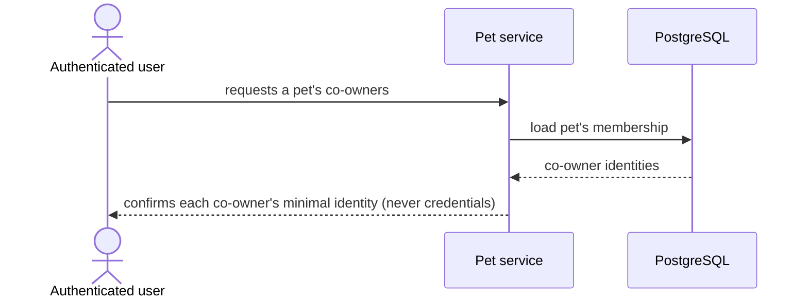

**Critical flow 9: Add a co-owner (US-07 / AC-09 / AC-09b / AC-09c / AC-12)**

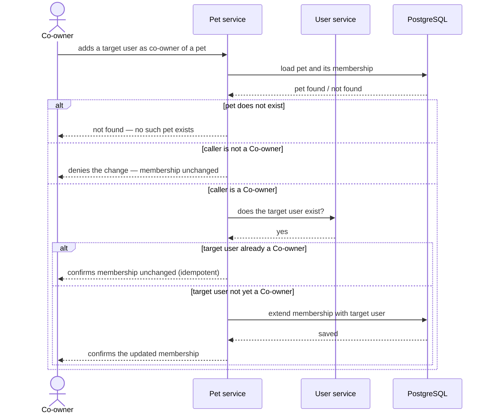

**Critical flow 2: Remove a co-owner under the no-orphan invariant — concurrent race (US-08 / AC-10 / AC-10b)**

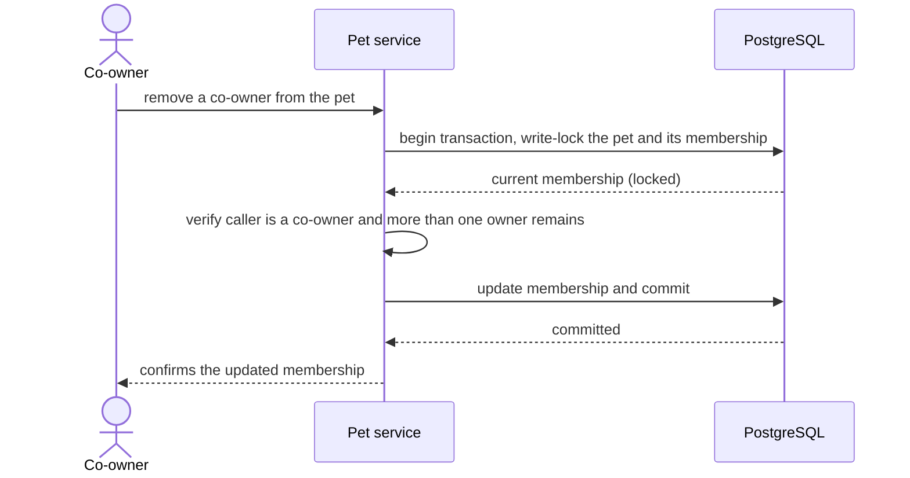

**Critical flow 10: Remove a co-owner — single request (US-08 / AC-10 / AC-11 / AC-11b / AC-11c / AC-12)**

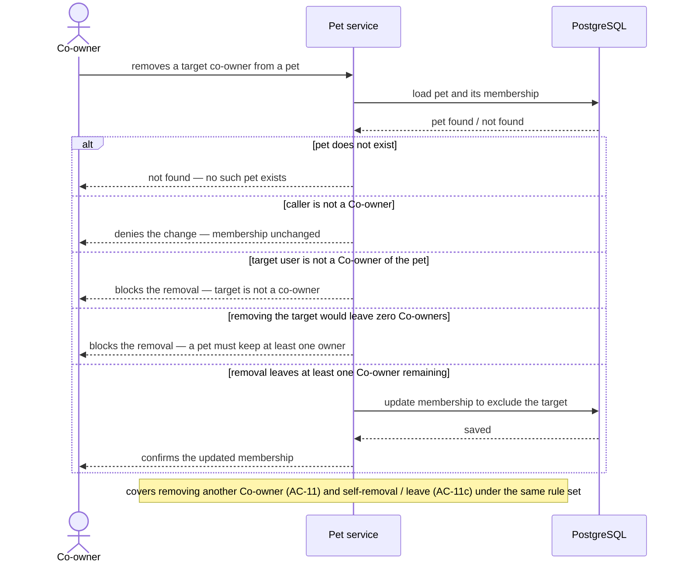

Flow 2 covers the concurrent-removal race (AC-10b) specifically; flow 10 covers the single-request remove-co-owner path (AC-10, AC-11, AC-11b, AC-11c). AC-12's not-found-before-authorization ordering is shown explicitly in flows 4, 6, 9, and 10; delete (flow 7) applies the same centralized `assertCoOwner` check (ADR-0001), so the pattern is not redrawn a further time.

**Use-case coverage (§4 → flow):**

| User story | Flow(s) |
|---|---|
| US-01 Register a pet | Flow 1 (happy), Flow 3 (validation & cross-context errors) |
| US-02 View a pet | Flow 4 |
| US-03 Browse pets | Flow 5 |
| US-04 Update a pet | Flow 6 |
| US-05 Remove a pet | Flow 7 |
| US-06 See a pet's co-owners | Flow 8 |
| US-07 Add a co-owner | Flow 9 |
| US-08 Remove a co-owner | Flow 2 (concurrent race), Flow 10 (single request) |

**Acceptance-criteria coverage (§5 → flow / branch):**

| AC | Shown by |
|---|---|
| AC-01 | Flow 1, happy path |
| AC-02 | Flow 3, `alt` branch (invalid input) |
| AC-03 | Flow 3, `alt` branch (create); Flow 6, `alt` branch (update) |
| AC-04 | Flow 4, `alt` branch (pet exists) |
| AC-05 | Flow 5, happy path |
| AC-06 | Flow 6, `alt` branch (not a Co-owner) |
| AC-06b | Flow 6, `alt` branch (Co-owner + pet type exists) |
| AC-07 | Flow 7, `alt` branch (not a Co-owner) |
| AC-07b | Flow 7, `alt` branch (Co-owner) |
| AC-08 | Flow 8, happy path |
| AC-09 | Flow 9, `alt` branch (not a Co-owner) |
| AC-09b | Flow 9, `alt` branch (target not yet a member) |
| AC-09c | Flow 9, `alt` branch (target already a member) |
| AC-10 | Flow 10, `alt` branch (would leave zero owners) |
| AC-10b | Flow 2, happy path (concurrent race, pessimistic lock) |
| AC-11 | Flow 10, `alt` branch (removal leaves ≥1 owner) |
| AC-11b | Flow 10, `alt` branch (target not a member) |
| AC-11c | Flow 10, `alt` branch (removal leaves ≥1 owner — self-removal variant, see the flow's closing note) |
| AC-12 | Flow 4, Flow 6, Flow 9, Flow 10, each `alt` branch (pet does not exist); the same centralized `assertCoOwner` check (ADR-0001) applies identically to Flow 7 delete |

Every §4 user story maps to ≥1 flow and every §5 acceptance criterion maps to a flow or an `alt`/`else` branch — no runtime-observable AC is left uncovered.

## 7. Deployment view

<!-- N/A: reuses the existing single API deployment unit + Postgres; this feature adds a module, no infra change. -->

## 8. Crosscutting concepts

| Concept | Convention | Where defined |
|---|---|---|
| Authentication | Global `AuthGuard` (`APP_GUARD`) verifies Bearer JWT; `@AuthUser('sub')` extracts the caller id | `src/core/auth/guards/auth.guard.ts` (existing) |
| Authorization | Inline per-pet **membership** check on every write path: load pet → not-found if absent (AC-12) → Co-owner check else Forbidden | §4, **ADR-0001** |
| Concurrency | Pessimistic write-lock transaction guards the no-orphan invariant on co-owner removal | §4, **ADR-0002** |
| Error handling | Services throw `NotFoundException`/`ForbiddenException`/`ConflictException`; global `DatabaseExceptionFilter` maps Postgres codes → JSON | `src/common/filters/database-exception.filter.ts` (existing) |
| Serialization / privacy | `to-public-pet` mapper projects entities; co-owner identity is minimal (name + id), never password/credentials | this feature (mirrors `to-public-user`) |
| Pagination | `ListFilterService` — offset pagination, bounded max page size, stable default ordering by id (`findAndCount`) | `src/common/list-filter/` (existing) |
| Validation | Global `ValidationPipe` + `class-validator` DTOs; name trimmed non-empty within max length, date-of-birth ≤ today (server UTC) | this feature (mirrors `user` DTOs) |
| ID strategy | Auto-increment integer via `BaseEntity` | `src/common/entities/base.entity.ts` (existing) |
| Cross-context validation | Pet-type existence checked via `PetTypeService`; added-user existence via `UserService` — synchronous injection, no events | §5, this feature |
| Events | N/A — no event bus; direct synchronous service injection | — |
| Internationalisation | N/A — single language | — |

## 9. Architecture decisions

| # | Title | Status | Section |
|---|---|---|---|
| 0001 | Enforce per-pet membership with an inline service-layer check | Accepted | §4, §8 |
| 0002 | Guard the no-orphan invariant with a pessimistic-lock transaction | Accepted | §4, §8 |

ADR files live under `docs/features/pet/adr/NNNN-<title>.md`.

## 10. Quality requirements

**QG-1. Authorization correctness (write-members)**
- **When:** an Authenticated user who is not a Co-owner attempts to update, delete, add-co-owner, or remove-co-owner on a pet.
- **Then:** the system denies the change and leaves the pet and its membership unchanged (spec §5 AC-06, AC-07, AC-09); a write on a non-existent pet returns not-found, not an authz denial (AC-12).
- **How verify:** negative integration tests per write path asserting denial + unchanged state, and a not-found test for a missing pet on every write route. KPI target: 100% of non-member write attempts denied (spec §7).

**QG-2. Data integrity — no-orphan invariant under concurrency**
- **When:** a pet has exactly two Co-owners and each simultaneously attempts to remove the other.
- **Then:** the invariant holds — the pet is left with at least one Co-owner (spec §6 concurrency row, AC-10b); a lone Co-owner cannot remove the last owner (AC-10).
- **How verify:** a concurrent-removal integration test exercising the pessimistic-lock transaction (ADR-0002), asserting ≥1 owner remains.

**QG-3. Privacy — no credential exposure**
- **When:** any pet, list, or co-owner response is serialized.
- **Then:** no response exposes a Co-owner's password or credentials (spec §6.1, §7); the co-owner list carries minimal identity only.
- **How verify:** response-shape tests over view / list / co-owner-list routes asserting absence of credential fields. KPI target: 0 responses exposing credentials (spec §7).

**QG-4. Performance (provisional)**
- **When:** create/update/delete/membership-change (write) and view/list/co-owners (read) run under normal load.
- **Then:** write p95 ≤ 300 ms *(provisional)* and read p95 ≤ 200 ms *(provisional)* (spec §6); the list stays paginated with a bounded page size so read latency does not degrade as the pet count grows.
- **How verify:** request-timing metrics in the API; the provisional targets are confirmed or replaced per the spec §8 open question before the interface is locked (see §11).

## 11. Risks and technical debt

| Risk / debt | Severity | Mitigation | Owner |
|---|---|---|---|
| A write path added later could forget the inline membership check (no framework backstop) | Medium | ADR-0001 centralizes the check in one `assertCoOwner` helper reused by every write path; negative tests per path (QG-1) | Tech Lead |
| Pet-type reference is a DB-level `CASCADE`, so deleting a pet type would silently destroy referencing pets | Medium | Out of scope here; routed to the pet-type context as a spec §8 open question (due before `sdd:data-model`) | Tech Lead |
| Provisional §6 latency targets (≤300 ms write / ≤200 ms read) have no measured baseline | Low | Confirm or replace per spec §8 open question (due before `sdd:api`); placeholders until then | Tech Lead |
| Read-all over sequential integer ids lets any Authenticated user enumerate pets and harvest co-owner identity | Low | Minimal-identity serialization (QG-3); email exposure deferred to spec §8 (due before `sdd:api`) | Security Lead |

**Accepted debt (acceptable in this iteration, plan to fix later):**
- **No migrations** — the Pet table + pet↔user join table are created by TypeORM `synchronize: true`; the repo has no migrations tree. This is a repo-wide gap the `data-model` stage owns, not a pet-specific choice; `synchronize: true` is unsafe for production.
- **Consent-less co-owner add** — a Co-owner may attach an arbitrary user directly (no invite/consent). Accepted per spec §3; revisited with the pet-invite feature.
- **Hard delete, no audit / undo / notification** — any Co-owner hard-deletes a shared pet for everyone, with no notification. Accepted per spec §3; notification is a spec §8 open question (post-MVP).

## 12. Glossary

| Term | Meaning |
|---|---|
| Authenticated user | Any signed-in user; may create pets and view/list any pet. Not an administrator (no admin role exists). |
| Co-owner (member) | An Authenticated user in a pet's membership; may edit/delete the pet and add/remove Co-owners. The creator is the first Co-owner. |
| Pet | The domain object for an animal (name, date of birth, a Pet type); co-owned by ≥1 Co-owner. |
| Pet type | An existing lookup value (e.g. dog, cat) a Pet must reference; owned by the separate pet-type context. |
| Membership | The set of Co-owners of a Pet (the pet↔user link), managed inline in this feature. |
| No-orphan invariant | The rule that a Pet must always keep at least one Co-owner; the last owner cannot be removed (delete the pet instead). |
| Read-all / write-members | Any Authenticated user may read any pet; only a Co-owner may write to it. |
