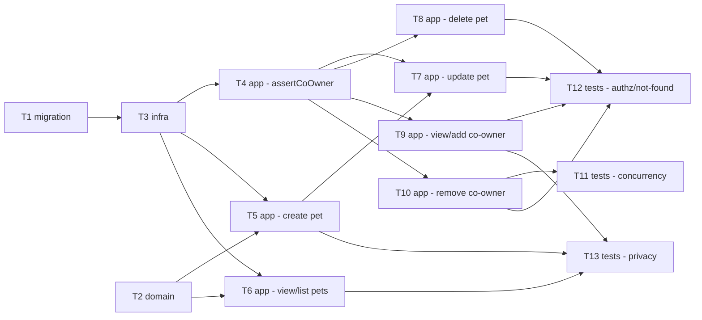

# Epic — pet

> **Spec:** [spec.md](../spec.md) · **Design:** [sad.md](../sad.md) · **Data model:** [data-model.md](../data-model.md) · **API:** [openapi.yaml](../contracts/openapi.yaml) · **ADRs:** [adr/](../adr/)

## Goal

Finish the half-built `pet` module so every Pet lifecycle operation (create, view, list, update, delete) is available to Authenticated users, with a new per-pet membership authorization boundary enforced on every write and co-ownership managed inline — never leaving a pet ownerless (spec §2 Goals).

## Scope

- **In:** promoting the staged schema migrations; the `pet` NestJS module (controller/service/dto/types/mappers); per-pet membership authorization (`assertCoOwner`, ADR-0001); the no-orphan invariant under concurrency (pessimistic-lock transaction, ADR-0002); integration tests for authorization, concurrency, and privacy.
- **Out:** invite/consent flow for adding a Co-owner, soft delete/undo, pet-visibility restriction, pet-type management (spec §3 non-goals — separate future features).

## Task map

## Tasks

See [tracker.md](./tracker.md) for status. Machine contract: [tasks.json](../tasks.json).

| # | Task | Layer | Blocked by | DoD (short) |
|---|---|---|---|---|
| T1 | Promote staged migrations, disable synchronize | migration | — | migrations apply + revert cleanly |
| T2 | Pet DTOs, public types, mappers | domain | — | validation + credential-free mapper unit tests pass |
| T3 | Wire PetModule + AppModule | infra | T1 | app boots with PetModule registered |
| T4 | assertCoOwner helper | app | T3 | not-found/forbidden/allowed unit tests pass |
| T5 | Create pet | app | T2, T3 | AC-01/AC-02/AC-03 integration tests pass |
| T6 | View + list pets | app | T2, T3 | AC-04/AC-05/AC-12 integration tests pass |
| T7 | Update pet | app | T4, T5 | AC-03/AC-06/AC-06b/AC-12 integration tests pass |
| T8 | Delete pet | app | T4 | AC-07/AC-07b/AC-12 integration tests pass |
| T9 | View + add co-owner | app | T4 | AC-08/AC-09/AC-09b/AC-09c/AC-12 integration tests pass |
| T10 | Remove co-owner (no-orphan invariant) | app | T4 | AC-10/AC-10b/AC-11/AC-11b/AC-11c/AC-12 integration tests pass |
| T11 | Concurrent no-orphan test | tests | T10 | concurrent-removal test asserts ≥1 owner remains |
| T12 | Authz + not-found negative tests | tests | T7, T8, T9, T10 | every write path denies non-members + 404s missing pets |
| T13 | Privacy response-shape tests | tests | T5, T6, T9 | no response ever exposes a credential field |

## Risks / Hard rules

- Every write path **must** call `assertCoOwner` (T4) — no framework backstop exists; a forgotten check is the top risk in sad §11.
- AC-12 ordering is a hard rule: not-found always wins over forbidden — never disguise a missing-pet write as a 403.
- The no-orphan invariant (T10) must use the pessimistic-lock transaction per ADR-0002 — a naive count-then-remove is racy and fails AC-10b.
- No pet/co-owner response may ever include a `password` or credential field (spec §6.1, §7) — enforced by T2's mapper and verified by T13.
